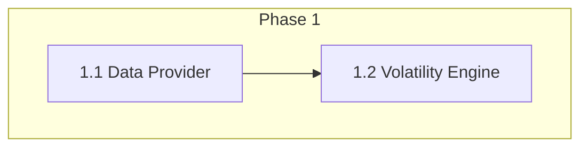
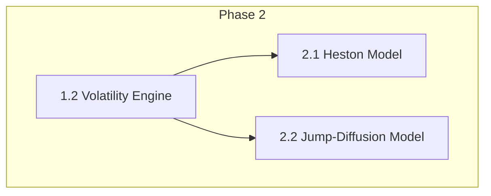
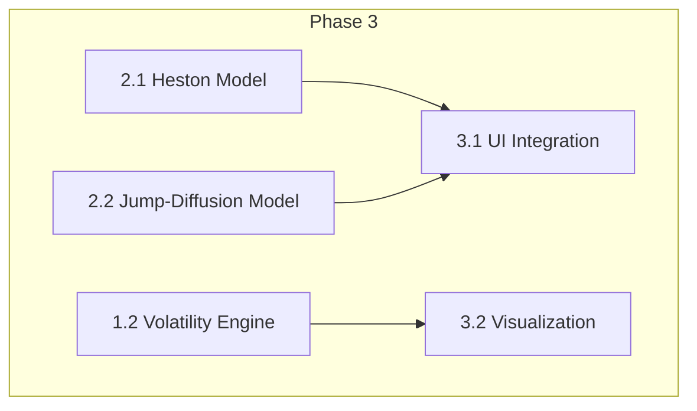
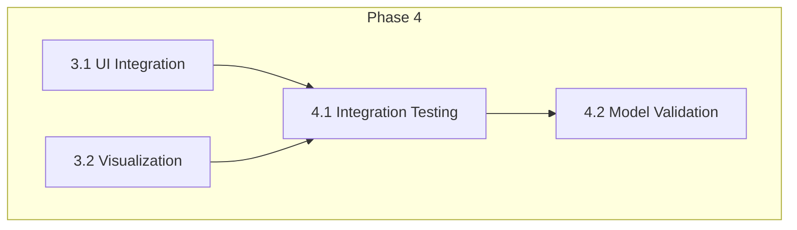
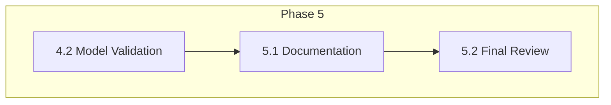

# Implementation Roadmap: Advanced Option Pricing Models

This roadmap breaks down the implementation process into five distinct phases, each with clear milestones, objectives, tasks, deliverables, and dependencies.

---

### Phase 1: Core Infrastructure Setup

This phase focuses on building the foundational components for data retrieval and volatility calculation.

*   **Milestone 1.1: Data Provider Implementation & Integration**
    *   **Objective:** To implement and integrate a reliable data provider to fetch real-time and historical financial data required for the pricing models.
    *   **Key Tasks:**
        *   Implement the `FinancialDataAPI` class in `data_provider.py`.
        *   Develop methods to fetch:
            *   Current stock prices.
            *   Historical price data for volatility calculations.
            *   Risk-free interest rates.
        *   Write comprehensive unit tests to validate the API's functionality and error handling.
        *   Integrate the `FinancialDataAPI` into the main application logic.
    *   **Deliverables:**
        *   A fully implemented and tested `data_provider.py` module.
        *   A suite of unit tests for the data provider.
    *   **Dependencies:** None.

*   **Milestone 1.2: Volatility Engine Implementation**
    *   **Objective:** To create a robust engine for calculating both historical and implied volatility, which are critical inputs for the advanced models.
    *   **Key Tasks:**
        *   Implement the `VolatilityEngine` class in `volatility_engine.py`.
        *   Implement a method to calculate historical volatility from the time-series data provided by the `FinancialDataAPI`.
        *   Implement a method to calculate implied volatility using the Black-Scholes model as a baseline.
        *   Write unit tests to ensure the accuracy of the volatility calculations.
    *   **Deliverables:**
        *   A fully implemented and tested `volatility_engine.py` module.
        *   A suite of unit tests for the volatility engine.
    *   **Dependencies:** Milestone 1.1: Data Provider Implementation & Integration.

---

### Phase 2: Advanced Model Implementation

This phase involves the core implementation of the Heston and Jump-Diffusion models.

*   **Milestone 2.1: Heston Model Implementation**
    *   **Objective:** To implement the Heston stochastic volatility model.
    *   **Key Tasks:**
        *   Define the `HestonModel` class in `advanced_models.py`, inheriting from the `BaseModel`.
        *   Implement the characteristic function for the Heston model.
        *   Use Fourier inversion to implement the option pricing formula.
        *   Write unit tests to verify the model's calculations against known results.
    *   **Deliverables:**
        *   `HestonModel` class within `advanced_models.py`.
        *   Unit tests for the Heston model.
    *   **Dependencies:** Milestone 1.2: Volatility Engine Implementation.

*   **Milestone 2.2: Jump-Diffusion (Merton) Model Implementation**
    *   **Objective:** To implement the Merton Jump-Diffusion model to account for sudden price jumps.
    *   **Key Tasks:**
        *   Define the `MertonModel` class in `advanced_models.py`, inheriting from the `BaseModel`.
        *   Implement the pricing formula, which incorporates the jump component.
        *   Write unit tests to validate the correctness of the Merton model implementation.
    *   **Deliverables:**
        *   `MertonModel` class within `advanced_models.py`.
        *   Unit tests for the Merton model.
    *   **Dependencies:** Milestone 1.2: Volatility Engine Implementation.

---

### Phase 3: UI Integration and Feature Enhancement

This phase focuses on integrating the new models and features into the Streamlit application.

*   **Milestone 3.1: Update Streamlit UI for New Models**
    *   **Objective:** To enhance the Streamlit UI to allow users to select and interact with the newly implemented advanced models.
    *   **Key Tasks:**
        *   Modify `streamlit_app.py` to include a dropdown menu for selecting between Black-Scholes, Heston, and Merton models.
        *   Dynamically display input fields for the parameters specific to the selected model.
        *   Ensure the UI correctly passes the user inputs to the backend and displays the calculated option price.
    *   **Deliverables:**
        *   An updated `streamlit_app.py` with a responsive and intuitive UI for model selection and parameter input.
    *   **Dependencies:** Milestone 2.1, Milestone 2.2.

*   **Milestone 3.2: Add Volatility and Data Visualization**
    *   **Objective:** To provide users with visual insights into the data being used for the pricing models.
    *   **Key Tasks:**
        *   In `streamlit_app.py`, add interactive charts to visualize:
            *   Historical stock prices.
            *   Calculated historical volatility over time.
        *   Create a dedicated section to display the fetched financial data, such as the risk-free interest rate.
    *   **Deliverables:**
        *   An enhanced Streamlit application with new data visualization components.
    *   **Dependencies:** Milestone 1.1, Milestone 1.2.

---

### Phase 4: Testing and Validation

This phase is dedicated to ensuring the new system is robust, accurate, and performs well.

*   **Milestone 4.1: Integration Testing**
    *   **Objective:** To conduct end-to-end testing to ensure all components (data provider, volatility engine, models, and UI) work together seamlessly.
    *   **Key Tasks:**
        *   Develop integration tests in `test_advanced_models.py` that simulate the full user workflow.
        *   Verify the data flow from the API through the calculation engines to the UI display.
    *   **Deliverables:**
        *   A comprehensive suite of integration tests.
    *   **Dependencies:** Milestone 3.1, Milestone 3.2.

*   **Milestone 4.2: Model Accuracy and Performance Validation**
    *   **Objective:** To validate the accuracy of the advanced models and analyze their performance.
    *   **Key Tasks:**
        *   Use `model_accuracy.py` to compare the output of the Heston and Merton models against real-world market data or established benchmarks.
        *   Profile the performance of the pricing calculations and identify any potential bottlenecks.
    *   **Deliverables:**
        *   A validation report detailing the accuracy and performance of the new models.
    *   **Dependencies:** Milestone 4.1.

---

### Phase 5: Documentation and Finalization

The final phase involves updating documentation and preparing the application for deployment.

*   **Milestone 5.1: Update Documentation**
    *   **Objective:** To update all project documentation to reflect the new features, architecture, and usage instructions.
    *   **Key Tasks:**
        *   Update the main `README.md` with instructions on how to run the application and use the new features.
        *   Expand the `ADVANCED_MODELS_README.md` with theoretical details and implementation notes for the new models.
        *   Ensure all new code is well-commented and includes clear docstrings.
    *   **Deliverables:**
        *   Updated and comprehensive project documentation.
    *   **Dependencies:** Milestone 4.2.

*   **Milestone 5.2: Final Review and Deployment Preparation**
    *   **Objective:** To conduct a final code review and prepare the application for a production release.
    *   **Key Tasks:**
        *   Perform a thorough code review of all new and modified files.
        *   Freeze the feature set and create a stable release branch.
        *   Update the `requirements.txt` file with any new dependencies.
        *   Prepare deployment scripts and instructions.
    *   **Deliverables:**
        *   A stable, well-documented, and deployment-ready application.
    *   **Dependencies:** Milestone 5.1.